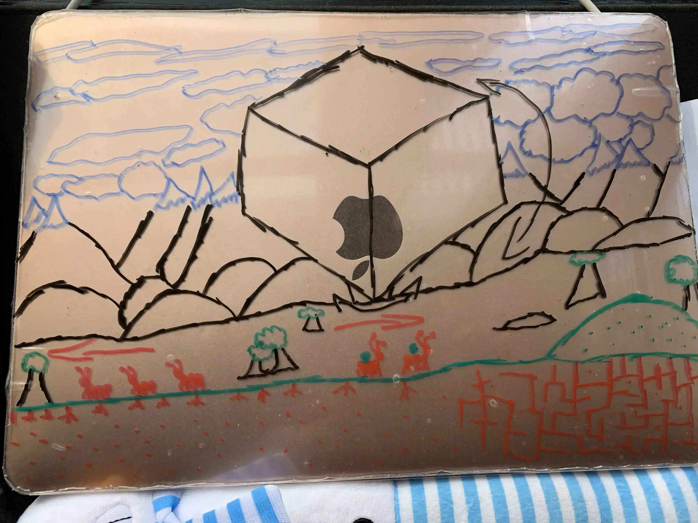

# Ant World V.1.0.5 Beta
This is a scss made framework for easier and faster styling use. Code and decorate faster with this easy to use style
sheet. As more progress is made, so will more documentation! This was the first implementation of my usually readme, so it's not the most organized. as well as my first framework!

## A Look into the World of Anthony
https://makemesenpai.github.io/Ant_World/

## Index:
1. [Checklist](#checklist)
    1. [Todo:](#todo)
    2. [Potential Features:](#potential-features)
    3. [Previous Updates:](#previous-updates)
2. [More Info](#more-info)
    1. [Idea](#idea)
    2. [Inspirations](#inspirations)
3. [Conclusion](#conclusion)

___
## Checklist

### TODO:
- Setup
    - [x] Based on wire-frames, create the home page using only html and css.
    - [x] Create landscape background using Maya
    - [x] Should have a placeholder square for the cube that will later replace it
- The Cube
    - [x] create a way for users to scroll, change, and easily navigate your pages on placeholder Cube.
    - [x] Create a 3d cube that users can navigate pages through
    - [x] pages should contain "coming soon" indicator, with basic content
- MVP (Home/Portfolio)
    - [x] create a portfolio page with all contents organized
    - [x] create custom scrollbar
    - [x] style portfolio displaying projects
    - [x] ensure that website is responsive via mobile first creation
    - [x] ensure that website is functional on all browsers
- Ant Attack! *stretch*
    - [x] create animations in maya
    - [x] find a way to create a video with transparent background
    - [x] create basic animation using css
    - [x] create mini-game! 
    - [x] create secrete
- Portfolio Redesign
    - [x] create new wire-frame for website
    - [x] reorganize content
    - [x] delete and add new/old content
    - [x] restyle based on new design
    - [x] *stretch* make more info pretty
- Seasonal Decorations *stretch*
    - [x] create skins/assets for every special occasion (outside of project)
    - [x] display decorations throughout the website, in none-distracting areas
    - [x] create an automated function that updates whether or not to show the user decorations or not.
- The Book
    - [] Complete the Book
    - [] make available for users to get a copy
    - [] automate updating paper to top posted/ most recently posted publications
- reorganize pages
    - [] reevaluate the value of certain pages, can they be mixed? should they no longer exist? (post note: music goes into art, maybe add hobbies page, remove bio and music)
    - [] create todo plan for all pages under "coming soon" in order to finish this website one page at a time.
    - [x] protect your work, and optimize the website via lighthouse and research.
    -NOTE: in the future we need to test this site on actual browsers and devices. Emulators and the real thing differ!

### Potential Features:
- nothing here... yet!

### Previous Updates:
- 1.0.0
    - Created variants of maya animations some of which need editing but honestly will probably not be, because it took hours
    - Added assets related to seasons. Which aren't mobil compatible.Icons from Flaticon.com
    - seasonal functionality, so I don't have  to manually update meaning seasonal decorations is complete!

- 0.9.6 
    - updated pages to meet lighthouse expectations. Getting a score of 95+
    - add searchable content by creating proper SEO descriptions using key words, and page permissions with robots.txt
    - optimize photos, loading times, and outside likes using: noopener, webp, etc.

- 0.7.5
    - Adjusted so available on all devices
    - created simple hamburger menu for navigation for the page
    - fixed footer, with added social links, and more section
    - Used emailjs to enable form sending in contact section
    - Changed layout based on new wire-frame design, creating a lot cleaner easier to read content by  deleting and reorganizing
___
## More Info

### Idea
I wanted to incorporate all my experience, publications, and projects in one place that I could be really proud of. I hoped to show the best representation of myself here. As Well as a complete representation of everything and anything I am. I worry that I am too ambitious, and not enough. So I hope to continuously work hard until I am more than enough, and all my dreams and ambitions can simply become tasks that can be done.

Here are the first wire-frames I made when planning this website. The planning took... more hours than I'd like to admit, but I'm glad to see where things have started and where they are headed for.

### Inspirations
* Ant hill, inspired by Ant world https://discordapp.com/invite/C9CvQjt
(The landscape [which will have blowing wind, and moving clouds] and later added maze game to the Ant World Link.) 
* The box, inspired by Anoukia Perry - In Pink https://www.pink.anoukiaperrey.com
(The Corner Corp. Box displaying all our different sections. These sections include: Software 
Engineering Portfolio, Literature, Music, Photography & Art, The Corner Corp., Biography and 
more[such as acting career and such]) https://3dtransforms.desandro.com/cube 
* Scrolling Sections, inspired by irui.is https://iuri.is
(When a user zooms into one of the sections, it will take them to another page that talks about 
that sections specifics, and when you scroll down, it should be clean and tell more about each 
sections important parts.)
* Ant Attack, inspired by Contrast visuals.com https://contrast-visuals.com/info/
(mini game where the ants run away like our IB, and users can smash them if they click on them. 
This will be an endless game, just for esthetics)
* Season Decorations, inspired by my first portfolio https://codepen.io/makemesenpai/full/vrVxvW
(Each CSS decorations will be held on each page, which will be on a timer or switch so that when 
the seasons change, we can change with them.)

___
## Conclusion
Thanks for checking this out. Feel free to leave feedback, and share!